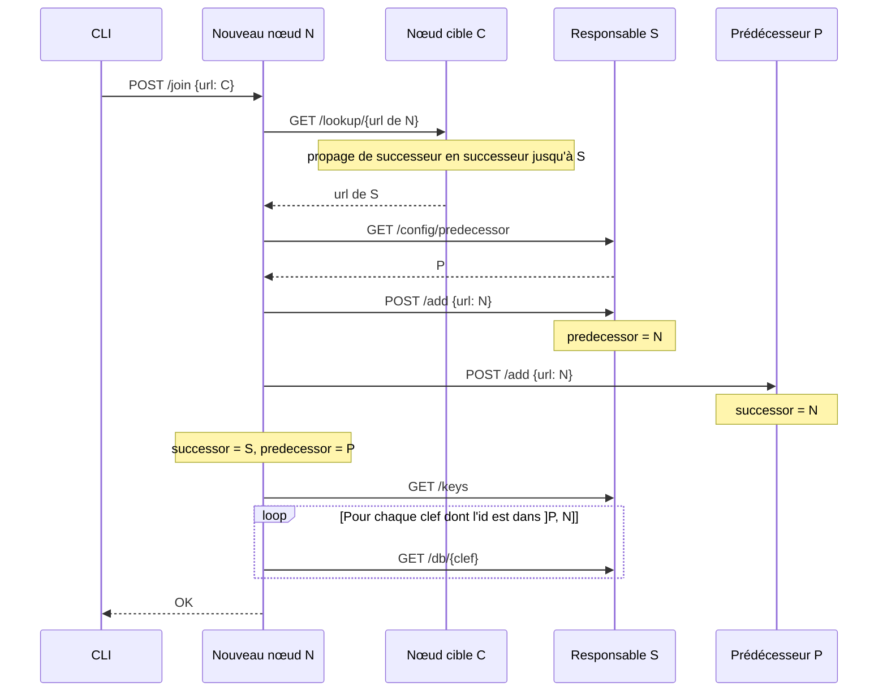

# SYD : DHT (Distributed Hash Table)

TD de DHT du cours de systèmes distribués du département TC à l'INSA Lyon.

L'objectif de ce TD est de comprendre le fonctionnement d'une Distributed Hash Table (DHT) soit une table de hachage distribuée en français et de l'implémenter. Pour cela, nous allons partir d'un serveur de base de données minimaliste pour arriver à une base de données distribuée. Nous utiliserons le protocole Chord.

Chord est un protocole de DHT qui permet d'associer une clef à un nœud sur un réseau pair à pair sans leader et où tous les nœuds sont égaux. La clef est une chaîne de caractères quelconque. Il permet de retrouver une clef en O(log(n)). Vous pouvez trouver le papier original ici : https://pdos.csail.mit.edu/papers/chord:sigcomm01/chord_sigcomm.pdf.

Je cite Wikipedia sur les avantages de Chord :

* Décentralisé : Chord est complètement décentralisé, tous les nœuds sont au même niveau. Ce qui le rend robuste et adapté aux applications P2P peu organisées.
* Passage à l'échelle : Le coût d'une recherche est fonction du logarithme du nombre de nœuds.
* Équilibrage de charge : Équilibrage de charge naturel, hérité de la Fonction de hachage (SHA-1).
* Disponibilité : On peut toujours trouver le nœud responsable d'une clef, même lorsque le système est instable.
* Aucune contrainte sur le nom des clefs.

Hum. Oups. Ça c'est le sujet que j'avais imaginé avant de me rendre compte que c'était trop compliqué pour un TD. On va implémenter une version un peu bancale d'une DHT mais dont l'objectif est de vous faire comprendre les grandes lignes. Pour simplifier, je vais rogner sur la propriété de passage à l'échelle. L'implémentation cible est une DHT qui permet de stocker des données sur un réseau pair à pair sans leader et où tous les nœuds sont égaux. Elle permet de retrouver une donnée en O(n) mais au prix d'un passage à l'échelle difficile et d'une très grande vulnérabilité aux attaques.

Concrètement, voici ce que l'on garde de Chord et ce que l'on laisse de côté :

| | Chord (article) | Ce TD |
|---|---|---|
| Placement des nœuds et des clefs | Hachage cohérent : SHA-1 sur un anneau de 2<sup>160</sup> positions | Le même principe, mais SHA-1 tronqué à `m = 6` bits (64 positions) |
| Ce que chaque nœud connait | Son prédécesseur, une liste de successeurs et une table de `m` raccourcis (*finger table*) | Son prédécesseur et son successeur |
| Recherche d'une clef | En sautant de raccourci en raccourci : O(log n) messages | De successeur en successeur : O(n) messages |
| Arrivée d'un nœud | `join`, puis une stabilisation périodique (`stabilize`/`notify`) qui corrige l'anneau | `join` qui prévient directement les deux voisins (`add`) |
| Départ ou panne d'un nœud | Liste de successeurs et réplication des clefs | Non géré : l'anneau est cassé |
| Arrivées simultanées | Corrigées par la stabilisation | Peuvent casser l'anneau |

Les deux premières lignes sont le cœur d'une DHT et vous les implémenterez entièrement. Les autres sont discutées dans [Limites et questions de réflexion](#limites-et-questions-de-réflexion).

## Prérequis

Je pars du principe que vous savez coder en Javascript et utiliser git et github. Si ce n'est pas le cas, je vous invite pour le prochain TD à lire :

* Javascript :
  * https://eloquentjavascript.net/ (troisième édition en anglais)
  * https://fr.eloquentjavascript.net/ (première edition en français, anglais, allemand et polonais)
* Programmation évènementielle en Javascript:
  * https://eloquentjavascript.net/11_async.html (Chapitre 11 de Eloquent JavaScript troisième édition)
  * http://www.fil.univ-lille1.fr/~routier/enseignement/licence/tw1/spoc/chap10-evenements-partie1.html (Vidéo / cours de Jean-Christophe Routier)
* Git : http://rogerdudler.github.io/git-guide/index.fr.html

Il vous faut aussi Node.js (version 18 minimum) et un éditeur de texte. Je vous conseille [Visual Studio Code](https://code.visualstudio.com/).

## Installation de node

Pour installer, voir TD précédent : https://github.com/dreimert/syd-scraping.

## Bootstrap et vérification de l'installation

Cloner ce dépôt :

    git clone https://github.com/dreimert/syd-dht.git

Se déplacer dans le dossier :

    cd syd-dht

Installation des dépendances :

    npm install

Lancer le code :

    node index.js

## Lancer plusieurs nœuds avec PM2

Vous allez faire tourner plusieurs nœuds en même temps. PM2, un gestionnaire de processus Node.js, vous évite d'ouvrir un terminal par nœud :

    npm install -g pm2
    pm2 start index.js --name n4000 --watch -- --port 4000
    pm2 start index.js --name n4001 --watch -- --port 4001
    pm2 log          # affiche les logs de tous les nœuds
    pm2 delete all   # arrête et supprime tous les nœuds

Le `--` sépare les options de PM2 de celles de votre programme. Avec `--watch`, PM2 redémarre le nœud à chaque modification du code. **Attention : un nœud redémarré a tout oublié** (voisins et base de données). Après une modification, relancez les commandes `join` pour reconstruire l'anneau. Plus de détails dans l'[annexe PM2](#annexe--pm2).

## Description technique

Une DHT est un réseau pair à pair qui permet d'associer une clef à un nœud. Pour cela, elle utilise une fonction de hachage qui permet de transformer une clef en une valeur numérique. Dans Chord, les nœuds sont disposés sur un **anneau** de taille 2<sup>m</sup>, `m` étant un paramètre du réseau. Ce `m` est fixe pour un réseau donné. **Un nœud est responsable des clefs dont la conversion en valeur numérique est incluse entre son prédécesseur (exclu) et lui (inclus) sur l'anneau**, soit l'intervalle ]prédécesseur, nœud]. Cette valeur numérique est ensuite utilisée pour trouver le nœud qui est responsable de cette clef. Pour cela, chaque nœud connait ses voisins. Lorsqu'un nœud reçoit une requête pour une clef, il regarde si c'est lui qui est responsable de la clef. Si c'est le cas, il renvoie la valeur associée à la clef, ou une erreur 404 si la clef n'existe pas. Sinon, il transmet la requête à son successeur sur l'anneau.

Par exemple, avec `m = 6` (positions 0 à 63) et trois nœuds d'identifiants 17, 23 et 47 :

| Nœud | Prédécesseur | Responsable de |
|---|---|---|
| 17 | 47 | ]47, 17], soit 48 à 63 puis 0 à 17 : l'intervalle passe par 0 |
| 23 | 17 | ]17, 23], soit 18 à 23 |
| 47 | 23 | ]23, 47], soit 24 à 47 |

Chaque position de l'anneau a exactement un responsable. Le cas où l'intervalle passe par 0 est le piège classique : c'est pour lui que la fonction `idIsInInterval` vous est donnée.

**Pour trouver le nœud responsable d'une clef, on utilise la fonction de hachage pour transformer la clef en valeur numérique**. La fonction de hachage garantit que les clefs sont réparties uniformément sur l'anneau. On va utiliser ici SHA. On fait de même pour placer les nœuds : dans un vrai réseau, on hacherait l'IP du nœud. Ici, nous sommes sur une machine locale et voulons y faire tourner plusieurs nœuds, donc nous hachons l'URL du nœud, qui contient son port.

Dans la vraie vie, utiliser l'IP pour calculer la valeur sur l'anneau empêche un attaquant de choisir la valeur de son nœud pour être responsable d'un grand nombre de clefs sauf si l'attaquant contrôle un grand nombre d'IP.

## Protocole

Dans notre DHT, les nœuds doivent supporter les opérations HTTP suivantes :

* GET db \<key\>: Récupère la valeur associée à la clef *key*. Si le nœud n'est pas responsable de la clef, propage la demande au nœud suivant et renvoie la réponse. Si la clef n'existe pas, renvoie une erreur 404.
* PUT db \<key\> \<value\> : Associe la valeur *value* à la clef *key*. Si le nœud n'est pas responsable de la clef, propage la demande au nœud suivant et renvoie la réponse.
* GET keys : Récupère la liste des clefs du nœud.
* GET lookup \<key\> : Renvoie le nœud responsable de la clef *key*. Si le nœud est responsable de la clef, renvoie son url sinon propage la demande au nœud suivant et renvoie la réponse.
* POST join \<url\> : Demande au nœud de rejoindre le réseau DHT du nœud cible de `url`.
* POST add \<url\> : Déclare la présence d'un nouveau nœud X sur le réseau qui a pour URL `url`. Le nœud N qui reçoit l'appel met à jour ses voisins, sans propager l'information :
  * si X est entre N et son successeur (intervalle ]N, successeur]), X devient le successeur de N ;
  * si X est entre le prédécesseur de N et N (intervalle ]prédécesseur, N]), X devient le prédécesseur de N.

  Un nœud seul est son propre successeur et prédécesseur : X devient donc les deux à la fois.
* GET config \<key\> : Permet de récupérer la valeur du paramètre `key` dans la configuration du nœud. Par exemple pour récupérer le successeur du nœud avec le port 4000, on fait un GET sur `http://localhost:4000/config/successor`.

## Code initial

Vous pouvez voir dans `index.js` qu'il y a déjà du code. Ce code est une base de donnée minimaliste et permet de lancer un serveur HTTP sur le port passé en paramètre. Pour lancer le code, il faut faire :

    node index.js --port 4000

Les fonctions de base de données sont déjà implémentées ainsi que celle de lecture de la configuration. Vous pouvez par exemple lancer le serveur et aller sur `http://localhost:4000/db/test` pour voir la valeur associée. Il y a quelques fonctions qui vous seront utiles pour la suite.

J'ai aussi codé un client qui permet d’interagir avec le serveur. Vous pouvez le lancer avec :

    node cli.js --port 4000 <commande>

Vous pouvez trouver la liste des commandes dans le fichier `cli.js` ou via `--help`. Par exemple, pour ajouter une valeur :

    node cli.js --port 4000 put test "Bonjour"

Si vous allez sur `http://localhost:4000/db/test`, vous devriez voir la valeur `Bonjour`. Allez maintenant sur `http://localhost:4000/config/id` pour voir l'identifiant du nœud et où il se place sur l'anneau.

## Implémentation

**Durant ce TD, vous ne devez modifier que le fichier `index.js`**.

La première chose à faire est l'implémentation du calcul de l'identifiant du nœud. On veut deux propriétés principales pour cette fonction :

* Elle doit être déterministe. C'est à dire que pour une URL donnée, elle doit toujours renvoyer la même valeur.
* Elle doit être uniforme. C'est à dire que pour un ensemble d'URL, les valeurs doivent être réparties uniformément sur l'anneau.

Pour ce faire, on va utiliser une fonction de hachage et plus spécifiquement SHA.

### Prenons un peu de *hash*

Une fonction de hachage est une fonction qui prend en entrée un ensemble de données et retourne une empreinte, aussi appelée *hash*. L'empreinte respecte deux principes : il est extrêmement difficile de trouver deux entrées qui donnent la même empreinte, et une empreinte donnée ne permet pas de remonter à l'entrée initiale. On parle de résistance aux collisions et de non calculabilité de la pré-image. Cette empreinte est de taille fixe quelque-soit l'entrée. Une fonction couramment utilisée est SHA. Voici quelques exemples d'empreinte :

```Bash
> echo -n "Blockchain" | shasum
# efe3fbaa6db3f43cf45d8ee3fdb168cd448afa41  -

> echo -n "Block" | shasum
# 82dd2cdf36f9436d89f404454654ad3e53fd428d  -

> echo -n "Vous commencez à voir le principe ?" | shasum
# 208d80b019417253e2139692bdcc408ad8030ff2  -
```

Une propriété intéressante est qu'une petite modification dans l'entrée change totalement l'empreinte :

```Bash
> echo -n "Blockchain" | shasum
# efe3fbaa6db3f43cf45d8ee3fdb168cd448afa41  -

> echo -n "blockchain" | shasum
# 56fde8f4392113e0f19e0430f14502e06968669f  -
```

L'option `-n` empêche `echo` d'ajouter un retour à la ligne, qui changerait l'empreinte. Vous obtenez ainsi la même empreinte qu'avec la fonction `getHash` ci-dessous.

Les fonctions de hachage sont couramment utilisées pour vérifier que des données n'ont pas été corrompues lors d'un téléchargement par exemple. Le code suivant permet de produire une empreinte en Javascript.

```Javascript
import crypto from 'crypto'

// Retourne l'empreinte de data.
const getHash = function getHash(data) {
  return crypto.createHash('sha1').update(data, 'utf8').digest('hex');
}
```

Mais ici, c'est un entier sur l'anneau que je veux. Il suffit de récupérer les `m` derniers bits de l’empreinte et de les convertir en un entier où `m` est l'exposant de la taille de l'anneau. Je vous ai mis la fonction `getIdFromString` dans le code du serveur qui fait exactement ça.

**Attention :** en ne gardant que `m` bits, on perd la résistance aux collisions. Avec `m = 6`, l'anneau ne compte que 64 positions et deux nœuds peuvent obtenir le même identifiant. C'est le cas de `http://localhost:4002` et `http://localhost:4006` (id 23). Évitez ces combinaisons de ports, ou augmentez `m` avec l'option `--size`. Question : que devrait faire votre implémentation si un nœud qui rejoint le réseau a le même identifiant qu'un nœud existant ?

#### Mettez à jour le code du serveur pour que l'identifiant du nœud soit calculé à partir de l'URL et initialise correctement la configuration

Vous pouvez vérifier via `http://localhost:4000/config/id`. En cas de problème, `pm2 log` pour voir les logs ;).

### Viewer

Pour vous simplifier la vie, j'ai codé un viewer. Dans un autre terminal, lancez `npm run viewer` puis ouvrez http://localhost:3000. Indiquez l'URL d'un nœud et cliquez sur *Afficher* : le viewer parcourt l'anneau en suivant successeurs et prédécesseurs, et dessine chaque nœud avec son intervalle de responsabilité. Il ne fonctionne qu'une fois l'identifiant du nœud calculé.

Gardez-le ouvert pendant tout le TD et cliquez sur *Afficher* après chaque `join` : si l'anneau dessiné ne correspond pas à ce que vous attendez, un `add` ou un `join` est faux.

### Briser la solitude

Pour le moment, notre nœud est tout seul sur l'anneau. Il faut donc qu'il rejoigne un autre nœud ou une DHT existante.

#### Commencez par lancer un deuxième nœud sur le port 4001

Pour vérifier qu'il fonctionne, regardez les logs du serveur et allez sur `http://localhost:4001/config/id`.

Les deux nœuds doivent maintenant communiquer. Via le CLI, vous pouvez faire :

    node cli.js --port 4001 join http://localhost:4000

pour demander au nœud 4001 de rejoindre le réseau du nœud 4000. Malheureusement, la commande n'est pas implémentée au niveau du serveur. *Let's go !*

Pour le moment, on va se limiter à deux nœuds. Ce que doit faire la commande `join` dans ce cas :

- Appeler la commande `add` du nœud cible pour lui dire qu'il va rejoindre le réseau.
- Et déclarer le nœud cible comme successeur et prédécesseur.
- Copier les clefs dont le nœud est responsable (cf. protocole).

Et c'est tout ;)

Si je déroule l’exécution de la commande `join` : Le CLI contacte le nœud 4001 via la commande `join`.

- Le nœud 4001 contacte le nœud 4000 via la commande `add`.
    - Le nœud 4000 met à jour son successeur et son prédécesseur avec nœud 4001 dans la commande `add`.
- Le nœud 4001 met à jour son successeur et son prédécesseur avec le nœud 4000.
- Le nœud 4001 demande les clefs dont est responsable le nœud 4000 à l'aide de la commande `keys`.
- Il calcule l'identifiant des clefs et garde celles dont il est responsable (Cf. protocole).
- Pour chaque clef dont il est responsable, il demande la valeur à 4000 et l'ajoute dans sa BDD.

Commencez par implémenter la commande `add` qui doit :

Vérifier si le nœud qui veut rejoindre le réseau est plus proche que le successeur ou le prédécesseur. Si c'est le cas, il doit le remplacer. Mais vu qu'il n'y a pas de successeur ou de prédécesseur, il suffit de mettre le nœud qui veut rejoindre le réseau comme successeur et comme prédécesseur.

#### Implémentez la commande `add` à deux nœuds

Via le CLI, vous pouvez simuler l'appel à la commande `add`.

Vous pouvez vérifier via le CLI ou votre navigateur que le successeur et le prédécesseur du nœud 4000 sont bien le nœud 4001 et inversement.

#### Implémentez la commande `join` à deux nœuds

Vous pouvez vérifier via le CLI ou votre navigateur que le successeur et le prédécesseur du nœud 4001 sont bien le nœud 4000. Et via les logs que le nœud 4000 a bien reçu la commande `add` et s'est mis à jour.

On ignore les clefs dans la base de donnée pour le moment.

### Trouver le ~~coupable~~ responsable

Vous avez deux nœuds sur l'anneau. Normalement, si vous avez utilisé les port 4000 et 4001 et que vous hachez l'url, ils ont respectivement les ids 47 et 17. Le nœud 4000 a pour id 47 et est responsable des clefs entre son prédécesseur et lui soit des clefs entre 18 et 47 et le nœud 4001 est responsable des clefs entre 48 et 17. Pour le moment, les nœuds ne savent pas qui est responsable de quelle clef. Il faut donc implémenter la commande `lookup` qui permet de trouver le nœud responsable d'une clef.

Pour vous aider :

- GET lookup \<key\> : Renvoie le nœud responsable de la clef key. Si le nœud est responsable de la clef, renvoie son url sinon propage la demande au nœud suivant et renvoie la réponse.
- Le nœud reçoit la clef sous forme de chaîne de caractères : utilisez `getIdFromString` pour calculer son identifiant sur l'anneau.
- Vous pouvez observer le code du CLI pour voir comment il fait des requêtes HTTP.

#### Implémentez la commande lookup

Pour tester :

    node cli.js lookup Bob # => 4000
    node cli.js lookup Alice # => 4001

### Stocker des données au bon endroit

Maintenant que vous savez qui est responsable de quelle clef, il faut stocker les données au bon endroit. Pour cela, il faut modifier les implémentations des commandes `get` et `put`.

#### Implémentez les commandes get et put

Pour tester :

    node cli.js put Bob Bob # => Doit enregistrer sur 4000
    node cli.js put Alice Alice # => Doit enregistrer sur 4001

    node cli.js get Alice

Utilisez les logs pour savoir où passe les requêtes et sur quelles machines sont stockées les données.

### Plus on est de fous, plus on rit

Vous avez maintenant un réseau de deux nœuds. Il faut maintenant que vous puissiez ajouter plus de nœuds au réseau. Pour cela, il faut modifier la commande `join` pour qu'elle puisse ajouter un nœud au réseau quelle que soit sa taille. Ce que doit faire la commande dans ce cas :

- Appeler la commande `lookup` du nœud cible pour récupérer le nœud responsable de la position du nœud appelant sur l'anneau. Astuce : l'identifiant du nœud étant le hash de son URL, il suffit de faire un `lookup` avec l'URL du nœud appelant comme clef.
- Récupérer le prédécesseur du nœud responsable.
- Appeler la commande `add` du nœud responsable.
- Appeler la commande `add` du prédécesseur.
- Mettez à jour le successeur et le prédécesseur du nœud appelant.
- Copier les clefs dont le nœud est responsable.

Le diagramme suivant montre les échanges quand un nouveau nœud N rejoint le réseau en passant par un nœud C quelconque. S est le nœud responsable de la position de N (son futur successeur), et P le prédécesseur de S (le futur prédécesseur de N) :



L'ordre compte : il faut demander le prédécesseur de S **avant** d'appeler `add` sur S. Après cet appel, le prédécesseur de S est N lui-même.

#### Implémentez la commande join à plusieurs nœuds
#### Mettez à jour la commande add si besoin

Votre `add` doit appliquer la règle complète décrite dans le [protocole](#protocole). Pour savoir si X est entre N et son successeur, `idIsInInterval(x, config.id, config.successor.id)` fait l'affaire.

Pour tester, partez de l'anneau à deux nœuds 4000 (id 47) et 4001 (id 17) et ajoutez quelques clefs :

    node cli.js put Bob Bob       # id 30, sur 4000
    node cli.js put Alice Alice   # id 49, sur 4001
    node cli.js put Heidi Heidi   # id 19, sur 4000

Lancez un nœud sur le port 4002 (id 23) et faites-le rejoindre le réseau :

    node cli.js --port 4002 join http://localhost:4000

Vous devez obtenir l'anneau 17 → 23 → 47 → 17 :

- 4002 a pour successeur 4000 et pour prédécesseur 4001 ;
- 4001 a pour successeur 4002, et 4000 a pour prédécesseur 4002 ;
- `node cli.js --port 4002 keys` contient `Heidi`, qui est dans ]17, 23] ;
- `node cli.js --port 4001 get Heidi` trouve toujours la valeur.

Recommencez en faisant rejoindre 4003 (id 60) via 4001 : il doit s'insérer entre 47 et 17.

## Limites et questions de réflexion

Votre DHT fonctionne tant que personne ne part et que les nœuds arrivent un par un. Ces questions explorent ce qui se passe sinon. Elles sont un bon entraînement pour l'évaluation.

1. **Clefs copiées.** Lors d'un `join`, les clefs sont copiées vers le nouveau nœud mais restent sur l'ancien. Est-ce un problème pour `get` ? Pour un `put` ultérieur ? Faudrait-il les supprimer, et qu'y gagne-t-on à les garder ?
2. **Panne.** Arrêtez un nœud avec `pm2 stop`. Que deviennent `get`, `put` et `lookup` ? Quelles clefs sont perdues ? Quelle information supplémentaire un nœud devrait-il connaitre pour contourner un successeur mort ? (Indice : la liste de successeurs de Chord.)
3. **Arrivées simultanées.** Deux nœuds dont les identifiants tombent dans le même intervalle font `join` en même temps. Déroulez les échanges du diagramme pour les deux : dans quel état est l'anneau à la fin ? Comment la stabilisation périodique de Chord règle-t-elle ce problème ?
4. **Coût.** Combien de requêtes HTTP coûte un `get` dans le pire cas avec n nœuds ? Dans Chord, la i-ème entrée de la *finger table* du nœud n pointe vers le responsable de n + 2<sup>i-1</sup>. Pourquoi cela ramène-t-il le coût à O(log n) ?
5. **Intervalle.** Pourquoi la responsabilité est-elle un intervalle ouvert d'un côté et fermé de l'autre ? Que se passerait-il avec [prédécesseur, nœud] ?
6. **Attaque.** Si chaque nœud pouvait choisir son identifiant, comment un attaquant pourrait-il empêcher l'accès à une clef précise ? Pourquoi hacher l'IP limite-t-il cette attaque, et pourquoi ne la supprime-t-il pas ?

## Évaluation

L'évaluation peut inclure le contenu de ce TD. Je ne demande pas de code mais je me réserve la possibilité de demander du pseudo code ou des APIs, une compréhension globale du fonctionnement. Je peux aussi demander une question maximum sur l'article original de Chord pour vous motiver à y jeter un œil.

## Pour aller plus loin

Vous pouvez trouver le papier original de Chord ici : https://pdos.csail.mit.edu/papers/chord:sigcomm01/chord_sigcomm.pdf.

Quelques articles plus vulgarisés sur Chord :

* https://jenkov.com/tutorials/p2p/chord.html
* https://medium.com/techlog/chord-building-a-dht-distributed-hash-table-in-golang-67c3ce17417b

Quelques extensions à implémenter, de la plus simple à la plus ambitieuse :

* **Départ propre** : une route `POST /leave` qui transfère les clefs du nœud à son successeur, puis relie son prédécesseur et son successeur entre eux. Testable avec `curl -X POST http://localhost:4002/leave`.
* **Stabilisation** : un `setInterval` où chaque nœud demande à son successeur son prédécesseur et corrige ses voisins si besoin (`stabilize`/`notify` dans l'article). Testez-la avec la question 3.
* **Finger table** : la mécanique de raccourcis de l'article, pour passer à des recherches en O(log n).

## Annexe : PM2

PM2 est un gestionnaire de processus Node.js. Il permet de lancer des processus en arrière plan et de les gérer. Il permet aussi de les redémarrer automatiquement en cas de crash ou de modification dans le cas de développement.

Pour l'installer globalement (`-g`) et rendre la commande accessible partout :

    npm install -g pm2

Pour lancer un processus Node.js :

    pm2 start monFichier.js

Si vous ne souhaitez pas l'installer globalement, vous pouvez l'installer localement (sans le `-g`) et utiliser la commande `npx` pour l'exécuter : `npx pm2 start monFichier.js`.

En développement, vous allez préférer utiliser l'option `--watch` qui permet de redémarrer le processus à chaque modification du fichier :

    pm2 start monFichier.js --watch

Pour lister les processus actifs :

    pm2 list

Pour arrêter un processus :

    pm2 stop <idDuProcessus>

Pour supprimer un processus :

    pm2 delete <idDuProcessus>

Pour monitorer les processus :

    pm2 monit

Pour passer des paramètres lors du lancement avec pm2, il faut utiliser `--` pour séparer les paramètres de pm2 des paramètres de votre programme :

    pm2 start monFichier.js --watch -- --param1 valeur1 --param2 valeur2

Et pour lancer plusieurs fois le même fichier avec des paramètres différents, il faut le nommer différemment :

    pm2 start monFichier.js --name Instance1
    pm2 start monFichier.js --name Instance2

Pour afficher les logs :

    pm2 log
